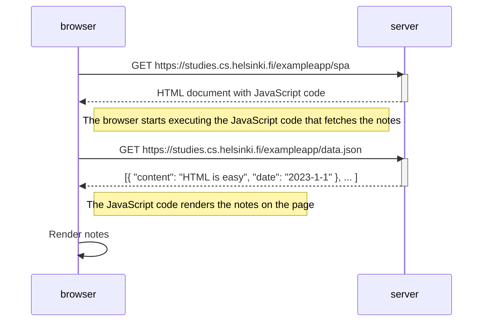

```mermaid
sequenceDiagram
    participant browser
    participant server
    
    browser->>server: GET https://studies.cs.helsinki.fi/exampleapp/spa
    activate server
    server-->>browser: HTML document with JavaScript code
    deactivate server
    
    Note right of browser: The browser starts executing the JavaScript code that fetches the notes
    
    browser->>server: GET https://studies.cs.helsinki.fi/exampleapp/data.json
    activate server
    server-->>browser: [{ "content": "HTML is easy", "date": "2023-1-1" }, ... ]
    deactivate server
    
    Note right of browser: The JavaScript code renders the notes on the page
    
    browser->>browser: Render notes
```