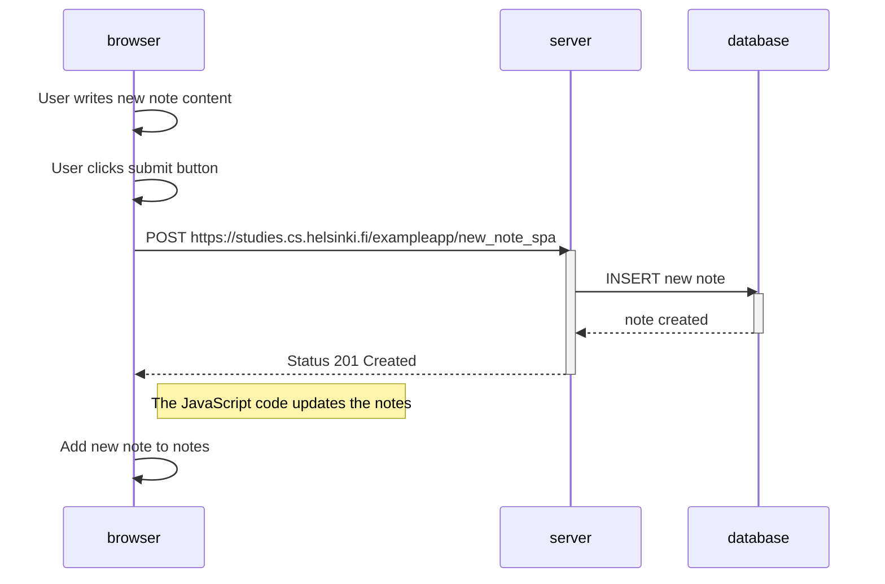

```mermaid
sequenceDiagram
    participant browser
    participant server
    participant database
    
    browser->>browser: User writes new note content
    browser->>browser: User clicks submit button
    browser->>server: POST https://studies.cs.helsinki.fi/exampleapp/new_note_spa
    activate server
    server->>database: INSERT new note
    activate database
    database-->>server: note created
    deactivate database
    server-->>browser: Status 201 Created
    deactivate server
    
    Note right of browser: The JavaScript code updates the notes
    
    browser->>browser: Add new note to notes

```